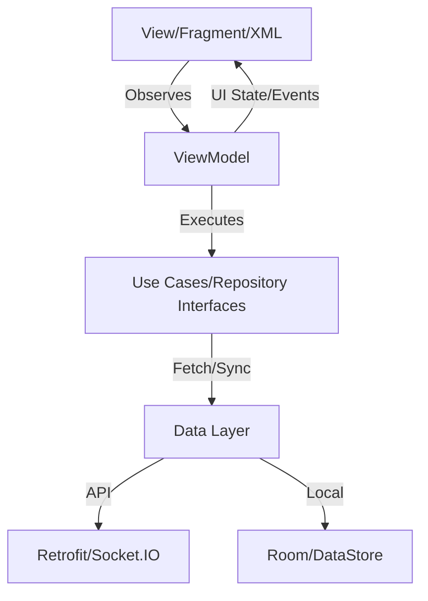

# The Kainchee - Android Salon Booking Platform ✂️


## 🚀 Project Overview
**The Kainchee** is a production-grade Android application designed to streamline the salon booking experience. Built with a full-stack approach, it ensures real-time synchronization and secure transactions, providing a seamless journey from discovery to confirmation.

## 🎥 Demo & Visuals
- **Watch Walkthrough:** [Demo Video Link](https://youtu.be/abGSdyXQKCM )
- **Screenshots:** Available in the `screenshots/` directory.

## 🛠 Key Technical Highlights
*   **Real-time Synchronization:** Powered by **Socket.IO** for instant slot availability updates across all active users.
*   **Concurrency Control:** Implemented **Redis Distributed Locks** on the backend to prevent race conditions and double bookings during high-demand periods.
*   **Modern Android Architecture:** Built using **MVVM**, **Clean Architecture**, and **Hilt** for a scalable, testable, and maintainable codebase.
*   **Offline-First:** Robust data persistence using **Room Database** and **DataStore Preferences** for a seamless user experience.
*   **Secure Payments:** Integrated **Razorpay Gateway** with server-side webhook verification.
*   **Location Intelligence:** Leverages **Google Maps & Places API** for precise salon discovery and location-based recommendations.

## 🏗 Architecture
The project strictly follows **Clean Architecture** principles to ensure separation of concerns and high maintainability.



# 📱 Application Screenshots

<p align="center">
  
  
  
</p>

<p align="center">
  
  
  
</p>

<p align="center">
  
  
  
</p>

<p align="center">
  
  
  
</p>
<p align="center">
  
  
  
</p>
<p align="center">
  
  
  
</p>
</p>
<p align="center">
  
  
</p>
---

# ✨ Features

## 🔐 Authentication

- OTP Login
- JWT Authentication
- Secure Session Handling
- DataStore Token Storage

---

## 📍 Location & Discovery

- Current Location Detection
- Google Maps Integration
- Google Places Search
- Saved Addresses
- Nearby Parlours
- Trending Parlours
- Category-Based Discovery
- Personalized Recommendations

---

## 💈 Appointment Booking

- Browse Parlours
- Explore Services
- Service Selection
- Stylist Selection
- Date Selection
- Real-Time Slot Availability
- Booking Preview
- Appointment Scheduling
- Booking Confirmation
- Booking Tracking
- Booking History
- Booking Details

---

## 💳 Payments

- Razorpay Integration
- Online Payments
- Cash Payments
- Wallet Payments
- Secure Payment Verification
- Payment Success Flow

---

## 👛 Wallet

- Wallet Balance
- Wallet Transactions
- Payment History
- Refund Support

---

## 🔔 Notifications

- Booking Confirmation
- Booking Cancellation
- Payment Updates
- Wallet Updates
- Promotional Notifications
- System Notifications

---

## 👤 User Profile

- Profile Management
- Edit Profile
- Saved Addresses
- Booking History
- Booking Details

---

## 🗺 Maps & Navigation

- Google Maps SDK
- Places API
- Current Location
- Parlour Location
- Turn-by-Turn Navigation

---

# 🏗 Architecture

The application follows modern Android development practices using **Clean Architecture** and **MVVM**.

```
Presentation Layer
        │
        ▼
ViewModel (StateFlow)
        │
        ▼
Repository
   │          │
   ▼          ▼
Remote API   Room Database
        │
        ▼
Node.js Backend
```

### Architecture Components

- MVVM Architecture
- Clean Architecture
- Repository Pattern
- Hilt Dependency Injection
- Kotlin Coroutines
- StateFlow
- Room Database
- DataStore
- Socket.IO
- Firebase Cloud Messaging (FCM)

---

# 🛠 Tech Stack

## Android

- Kotlin
- MVVM
- Clean Architecture
- Hilt
- Retrofit
- OkHttp
- Coroutines
- StateFlow
- Room
- DataStore
- Navigation Component
- Material 3

---

## Backend

- Node.js
- Express.js
- MongoDB
- Redis
- Socket.IO
- JWT Authentication
- REST APIs

---

## Maps

- Google Maps SDK
- Places API

---

## Payments

- Razorpay

---

## Notifications

- Firebase Cloud Messaging (FCM)

---

# 🌐 Backend Repository

The backend powering THE KAINCHEE is available here:

https://github.com/ShahzadAnsari13/the-kainchee-backend

---


# 🚀 Highlights

- Production-Grade Android Application
- Real-Time Appointment Booking
- Secure OTP Authentication
- Google Maps & Places Integration
- Socket.IO Real-Time Updates
- Wallet System
- Razorpay Payment Integration
- Firebase Push Notifications
- Modern MVVM + Clean Architecture
- Scalable Backend Integration

---

# 👨‍💻 Developer

**Shahzad Ansari**

### LinkedIn

https://www.linkedin.com/in/shahzad-ansari-306345363

### GitHub

https://github.com/ShahzadAnsari13

---

⭐ If you found this project useful, consider giving it a star.
