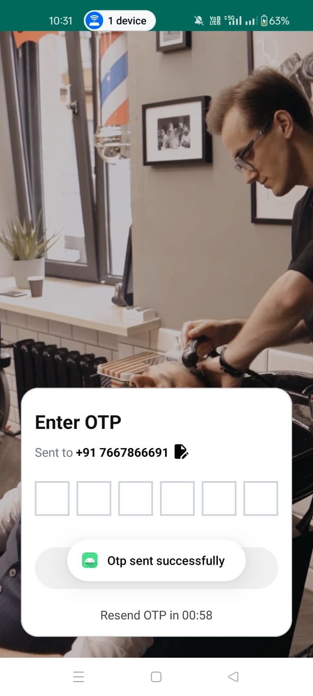
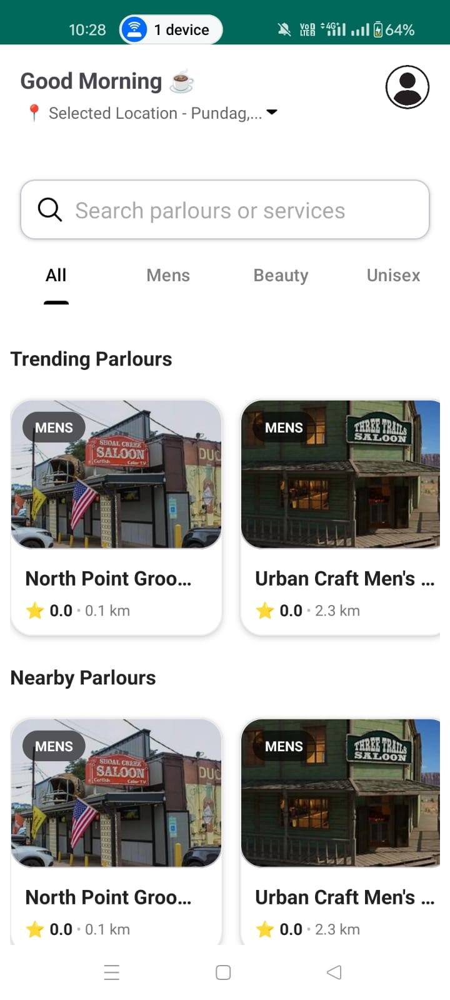
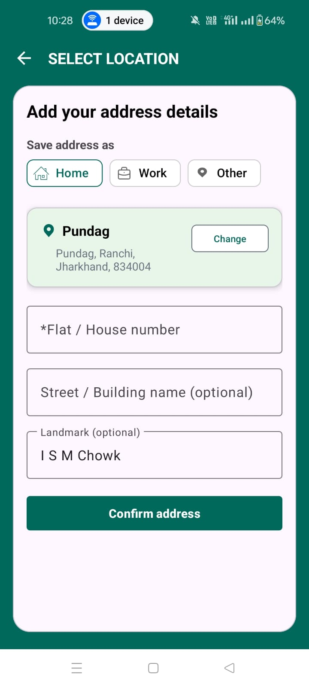
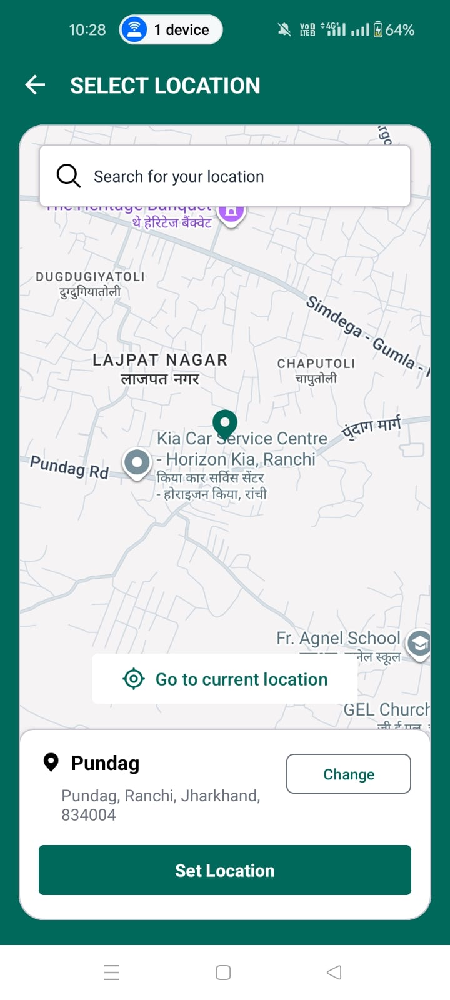
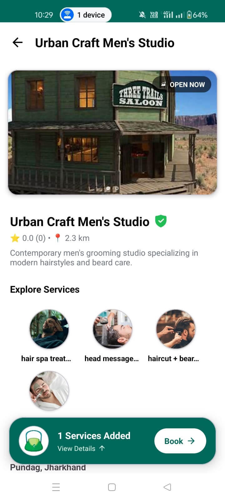
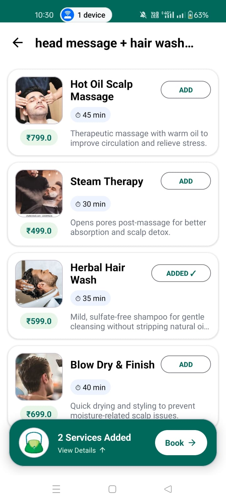
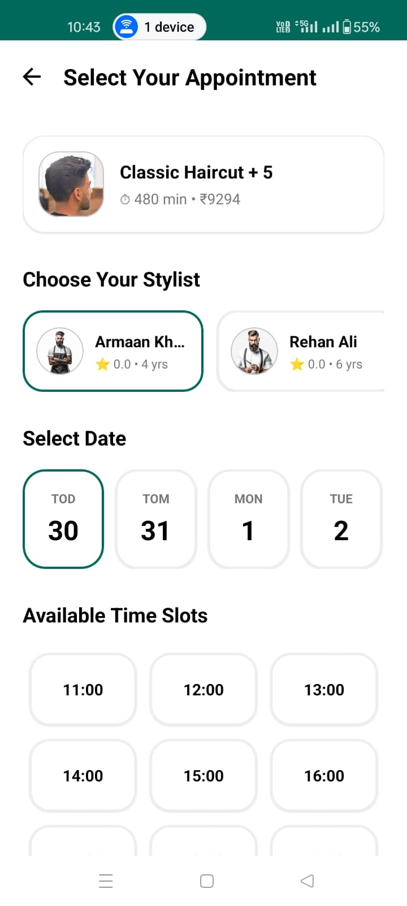
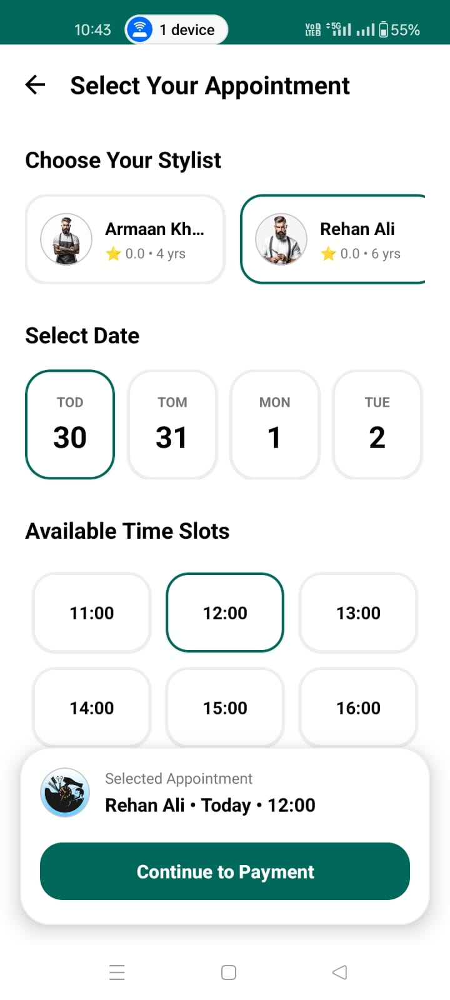

````markdown
# ✂️ THE KAINCHEE USER

### Modern Salon & Parlour Booking Application

THE KAINCHEE USER is a production-ready Android application that enables users to discover nearby parlours, explore services, select stylists, choose appointment slots, and book grooming services seamlessly.

Built using modern Android development practices with **Kotlin, MVVM, Clean Architecture, Hilt, Retrofit, OkHttp, Coroutines, Room Database, DataStore, Google Maps SDK, Places API, and Navigation Component**.

---

## 🎥 Demo Video

Watch the complete application walkthrough:

👉 https://youtube.com/shorts/mVcTSJBwLGE?si=Kun5t6e6-0twuU7c

---

# 📱 Application Screenshots

<p align="center">
  
  
  
</p>

<p align="center">
  
  
  
</p>

<p align="center">
  
  
  
</p>

<p align="center">
  
</p>

---

# 🚀 Features

## 🔐 Authentication

- OTP Based Login
- JWT Authentication
- Secure Session Handling
- Persistent Login Sessions
- Secure Token Storage using DataStore

---

## 📍 Location Management

- Current Location Detection
- Google Places Search
- Multiple Saved Addresses
- Home / Work / Other Labels
- Default Address Selection
- Dynamic Location Switching
- Geocoder Address Resolution

---

## 🏪 Parlour Discovery

- Nearby Parlours
- Trending Parlours
- Category Based Filtering
- Distance Based Search
- Verified Parlour Listings
- Real-Time Availability

---

## ✂️ Service Management

- Browse Services By Category
- Dynamic Service Selection
- Add / Remove Services
- Real-Time Price Calculation
- Duration Calculation

---

## 👨‍🔧 Stylist Selection

- Multiple Stylists
- Experience Information
- Stylist Based Scheduling

---

## 📅 Appointment Scheduling

- Date Selection
- Time Slot Selection
- Dynamic Slot Availability
- Appointment Summary

---

## 🗺️ Navigation Support

- Google Maps Integration
- Parlour Location View
- Turn By Turn Directions
- Distance Calculation

---

## 📋 Booking System

- Booking Preview
- Dynamic Cart
- Appointment Confirmation
- Upcoming Bookings
- Booking Tracking

---

## 🎨 User Experience

- Empty State Handling
- Error State Handling
- Loading States
- Responsive Design
- Smooth Navigation Flow

---

# 🏗️ Architecture

The application follows **MVVM + Clean Architecture** principles with complete separation of concerns.

```text
Presentation Layer
        ↓
Domain Layer
        ↓
Data Layer
```

---

# 📂 Project Structure

```text
com.thekainchee.user
│
├── data
│   ├── local
│   ├── location
│   ├── mapper
│   ├── remote
│   └── repository
│
├── domain
│   ├── model
│   ├── repository
│   └── usecase
│
├── di
│   ├── DatabaseModule
│   ├── NetworkModule
│   └── RepositoryModule
│
├── presentation
│   ├── auth
│   ├── base
│   ├── booking
│   ├── common
│   ├── dashboard
│   ├── location
│   ├── parlour
│   ├── service
│   └── splash
│
├── utils
│
└── MainActivity
```

---

# 📚 Layer Breakdown

## Presentation Layer

Responsible for:

- Activities
- Fragments
- ViewModels
- UI States
- Navigation
- Adapters

```text
presentation
├── auth
├── booking
├── dashboard
├── location
├── parlour
├── service
├── splash
├── common
└── base
```

---

## Domain Layer

Responsible for business logic.

Contains:

- Domain Models
- Repository Contracts
- Use Cases

```text
domain
├── model
├── repository
└── usecase
```

---

## Data Layer

Responsible for data management.

Contains:

- Retrofit APIs
- DTO Models
- Room Database
- Repository Implementations
- Data Mappers
- Location Services

```text
data
├── local
├── location
├── mapper
├── remote
└── repository
```

---

## Dependency Injection

Implemented using Hilt.

```text
di
├── DatabaseModule
├── NetworkModule
└── RepositoryModule
```

Provides:

- Retrofit
- OkHttp
- Repositories
- Room Database
- Singleton Dependencies

---

# 🛠️ Tech Stack

## Language

- Kotlin

## Architecture

- MVVM
- Clean Architecture

## Dependency Injection

- Hilt

## Networking

- Retrofit
- OkHttp

## Asynchronous Programming

- Kotlin Coroutines
- Kotlin Flow

## Local Storage

- Room Database
- DataStore

## Maps & Location

- Google Maps SDK
- Google Places API
- Fused Location Provider

## UI

- XML
- Material Design 3
- Navigation Component

---

# 🔄 Complete User Flow

```text
Splash
   ↓
Authentication
   ↓
Location Selection
   ↓
Home Screen
   ↓
Nearby Parlours
   ↓
Parlour Details
   ↓
Service Selection
   ↓
Booking Preview
   ↓
Stylist Selection
   ↓
Date Selection
   ↓
Time Slot Selection
   ↓
Payment
   ↓
Booking Confirmation
   ↓
Upcoming Bookings
```

---

# 🎯 Key Highlights

- Feature Based Architecture
- MVVM + Clean Architecture
- Hilt Dependency Injection
- Google Maps Integration
- Google Places Search
- Dynamic Slot Booking System
- Stylist Based Scheduling
- Multi-Service Booking
- Location Based Parlour Discovery
- Production Ready Folder Structure

---

# 🌐 Backend Repository

THE KAINCHEE Android application is fully integrated with a custom Node.js backend.

Backend Repository:

https://github.com/ShahzadAnsari13/the-kainchee-backend

---

# 🔮 Upcoming Features

- Razorpay Payment Gateway
- Booking Cancellation
- Booking Rescheduling
- Push Notifications
- Wallet System
- Loyalty Rewards
- Reviews & Ratings
- Coupons & Offers
- Dark Mode
- Real-Time Booking Updates

---

# ⚙️ Setup

### Clone Repository

```bash
git clone https://github.com/ShahzadAnsari13/the-kainchee-android.git
```

### Open Project

```bash
Android Studio Hedgehog+
```

### Add API Keys

```properties
MAPS_API_KEY=YOUR_KEY
PLACES_API_KEY=YOUR_KEY
```

### Build & Run

```bash
Sync Gradle
Run Application
```

---

# 👨‍💻 Developer

### Shahzad Ansari

- LinkedIn: https://www.linkedin.com/in/shahzad-ansari-306345363
- GitHub: https://github.com/ShahzadAnsari13
- LeetCode: https://leetcode.com/ShahzadAnsari13

---

## ⭐ Project Goal

THE KAINCHEE USER aims to simplify salon appointment booking through location-based discovery, intelligent scheduling, seamless service selection, and a modern Android user experience.

---

### Made with ❤️ using Kotlin & Modern Android Development Practices
````
