✂️ THE KAINCHEE USER
Production-Grade Appointment Booking Application

THE KAINCHEE USER is a modern Android application that enables users to discover nearby parlours, explore services, select stylists, choose appointment slots, and book grooming services seamlessly.

Built using Kotlin, MVVM, Clean Architecture, Hilt, Retrofit, Coroutines, Room, DataStore, Google Maps SDK, Places API, and Navigation Component.
---

## 🎥 Demo Video

Watch the complete application walkthrough:

👉 https://youtube.com/shorts/mVcTSJBwLGE?si=Kun5t6e6-0twuU7c

---

# 📱 Application Screenshots

<p align="center">
  
  
  
</p>

<p align="center">
  
  
  
</p>

<p align="center">
  
  
  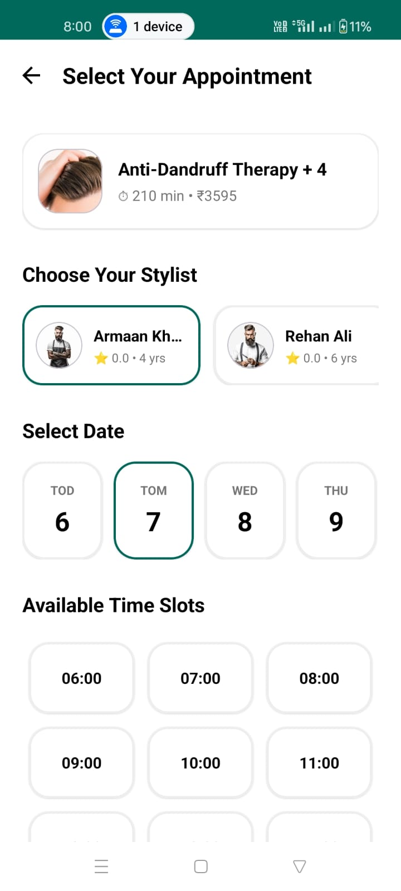
</p>

<p align="center">
  
  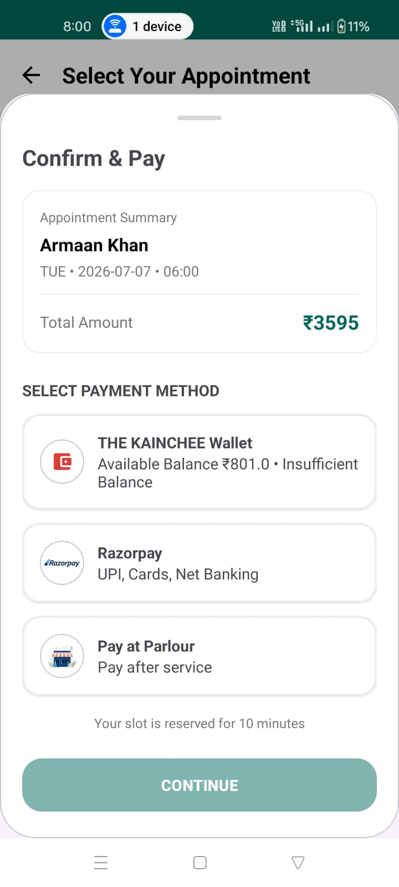
  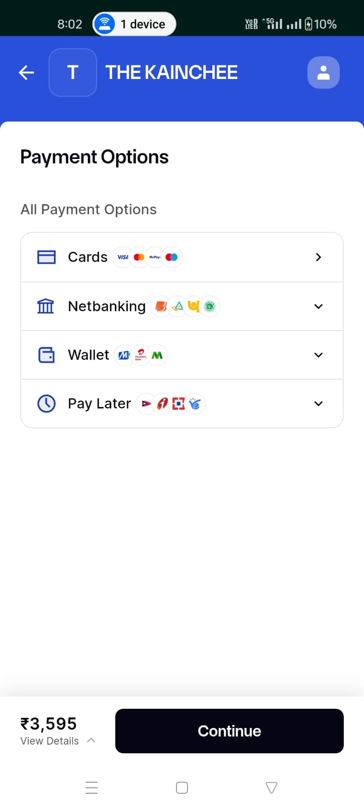
</p>
<p align="center">
  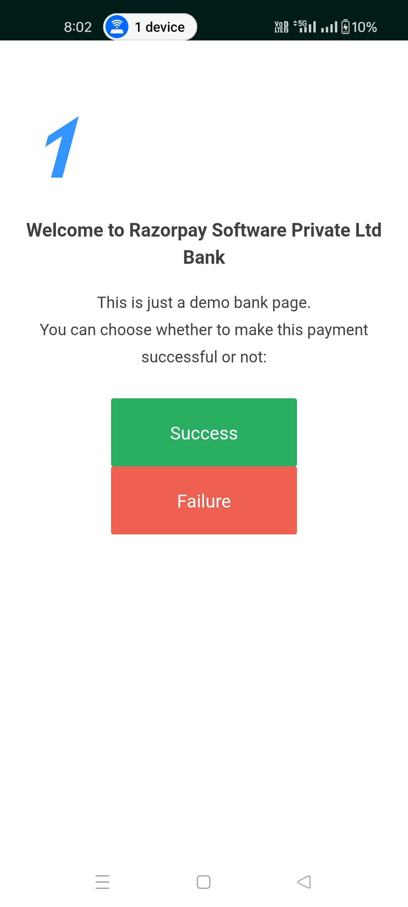
  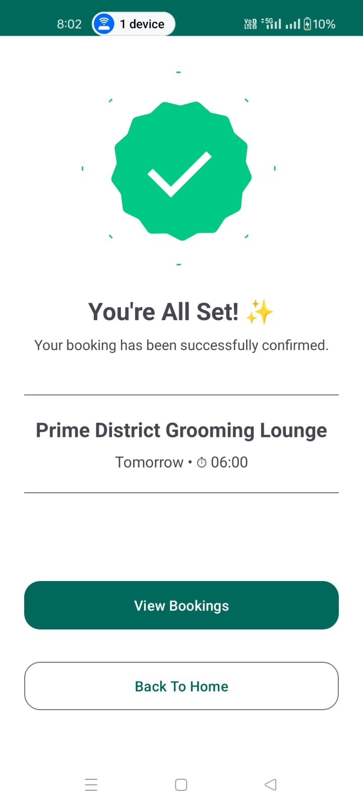
  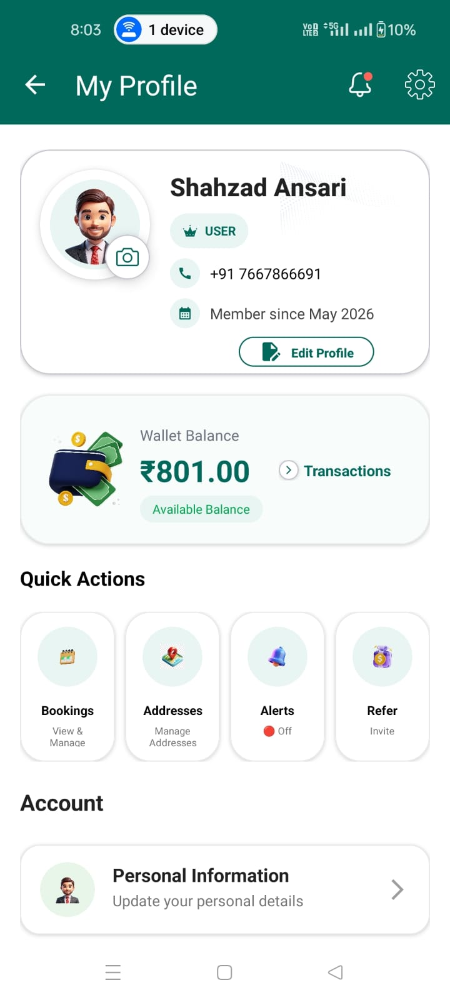
</p>
<p align="center">
  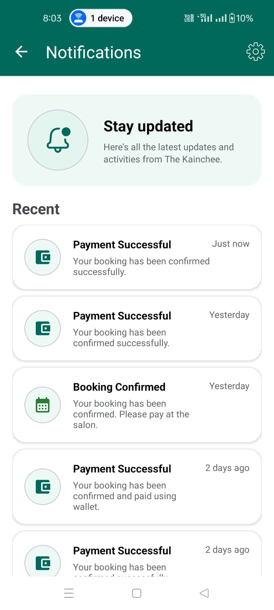
  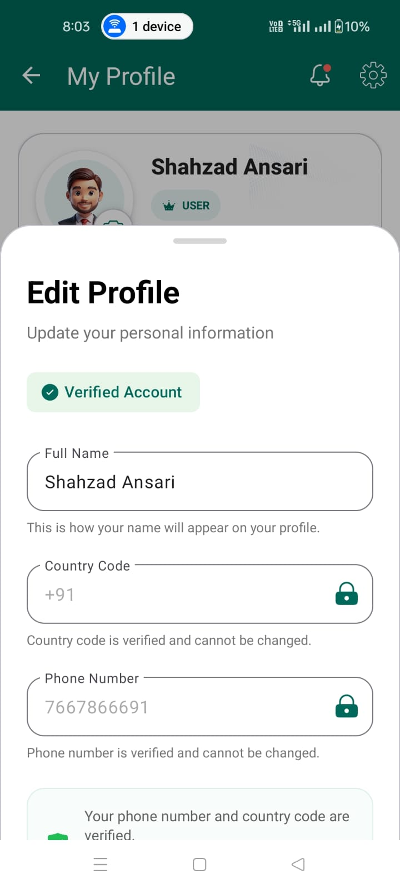
  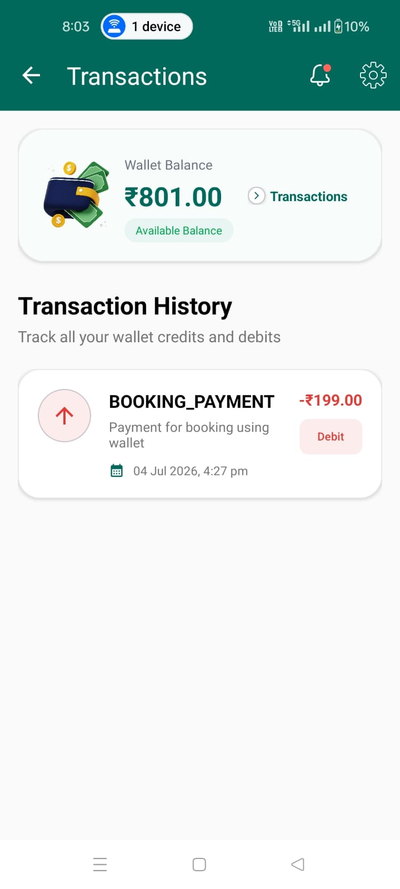
</p>
</p>
<p align="center">
  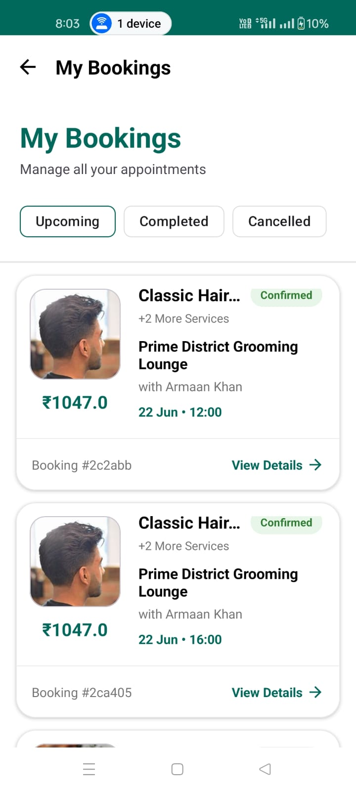
  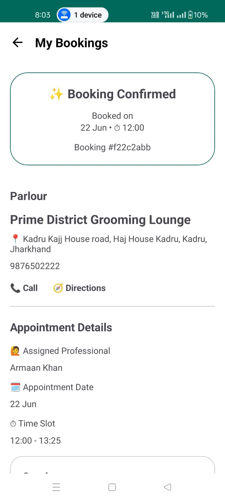
</p>
---


## 🚀 Features
### Authentication
- OTP Login
- JWT Authentication
- Secure Session Handling
- DataStore Token Storage

### Location & Discovery
- Current Location Detection
- Google Places Search
- Saved Addresses
- Nearby & Trending Parlours
- Category-Based Discovery

### Booking System
- Service Selection
- Stylist Selection
- Dynamic Slot Availability
- Appointment Scheduling
- Booking Tracking

### Maps & Navigation
- Google Maps Integration
- Parlour Location View
- Turn-by-Turn Navigation

## 🏗️ Architecture
- MVVM Architecture
- Clean Architecture
- Repository Pattern
- Hilt Dependency Injection
- Kotlin Coroutines & Flow
## 🛠️ Tech Stack

### Android
- Kotlin
- MVVM
- Hilt
- Retrofit
- Coroutines
- Room
- DataStore

### Maps
- Google Maps SDK
- Places API

### Backend
- Node.js
- Express.js
- MongoDB
- REST APIs
- Socket.IO
- Redis

## 🌐 Backend Repository

https://github.com/ShahzadAnsari13/the-kainchee-backend

## ⚙️ Setup
git clone https://github.com/ShahzadAnsari13/the-kainchee-android.git

## Required API Keys

Enable the following APIs in Google Cloud Console:

- Maps SDK for Android
- Places API

Add your keys in local.properties:

```properties
MAPS_API_KEY=YOUR_GOOGLE_MAPS_API_KEY
PLACES_API_KEY=YOUR_GOOGLE_PLACES_API_KEY
```

## 👨‍💻 Developer

Shahzad Ansari

LinkedIn:
https://www.linkedin.com/in/shahzad-ansari-306345363

GitHub:
https://github.com/ShahzadAnsari13
